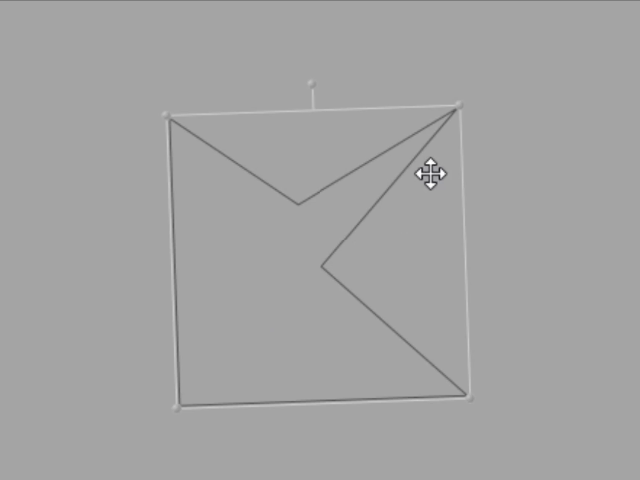

# ManipulatedBBox
[](https://www.nuget.org/packages/HMTools.ManipulatedBBox)

## About
WPF Bounding Box for easy manipulation.

## Features
- Drag & Drop
- Resize (Corners & Edges)
- Rotate
- Show BoundingBox Size
- Set Size Ratio (eg. "0.5" -> [1:2])

## Note
***Please add an issue on this repository, for every bug fix or additional feature that you wish I'll add.</br>
And I'll try to handle it as fast as I can.***

## Getting Started
ManipulatedBBox is available on NuGet:
```
Install-Package HMTools.ManipulatedBBox
```

## Code Usage Example

    xmlns:bbox="clr-namespace:ManipulatedBBox;assembly=ManipulatedBBox"

	<Grid Background="Gray">
        <bbox:BBox VerticalAlignment="Bottom" HorizontalAlignment="Left"
               Width="200" Height="200" SizeRatio="1.5">
            <Polygon Points="10,110 60,10 110,110, 80, 150, 165, 250"
             Fill="Blue" Stretch="Fill"/>
        </bbox:BBox>
    </Grid>

## ScreenShots
### Easy Activate


### Drag And Drop


### Rotate


### Resize


